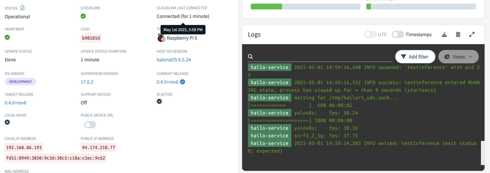
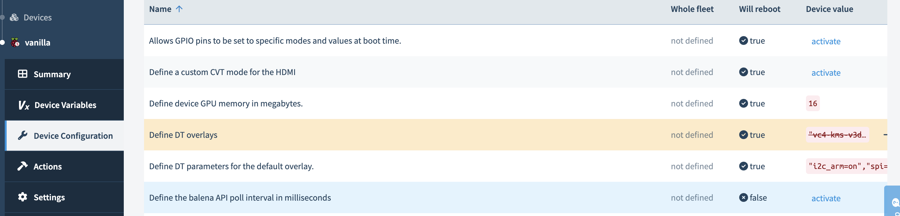

# Hailo AI on balena Raspberry Pi 5

This project is a demonstration of how to install and use the hailo8 firmware on a raspberry pi 5. It also install and sets up the `hailort_service` which is neccessary for running multi-process inference.

## Usage:
Clone this project and then run the following from the root of the project, where `myFleet` is the name of you fleet on balenaCloud:
```
balena push myFleet
```


## Configuration

In order to make use of Gen 3 PCI, ensure that your device overlay setting on `https://dashboard.balena-cloud.com/devices/<DEVICE_UUID>/config` is set to the following:
```
"vc4-kms-v3d,cma-320","dwc2,dr_mode=host","dwc2,dr_mode=host,pciex1_gen=3"
```



## Testing:
For all of the tests below open a terminal session to hailo-service.
1. Check that the hailo device is correctly connected:
```
root@b432f02c44f7:~# hailortcli fw-control identify
Executing on device: 0001:01:00.0
Identifying board
Control Protocol Version: 2
Firmware Version: 4.20.0 (release,app,extended context switch buffer)
Logger Version: 0
Board Name: Hailo-8
Device Architecture: HAILO8L
Serial Number: HLDDLBB243201979
Part Number: HM21LB1C2LAE
Product Name: HAILO-8L AI ACC M.2 B+M KEY MODULE EXT TMP
```

2. Check that hailo_service is running:
```
root@e72577fb98d2:~# supervisorctl status
hailort_service                  RUNNING   pid 26, uptime 0:03:15
```

3. Test that multi-process processing works:
```
hailortcli run2 --multi-process-service set-net /root/models/yolov8s-hailo8l.hef set-net /root/models/scrfd_2.5g-hailo8l.hef
```
You should see an output like this
```
root@e72577fb98d2:~/models# hailortcli run2 --multi-process-service set-net /root/models/yolov8s-hailo8l.hef set-net /root/models/scrfd_2.5g-hailo8l.hef
[===================>] 100% 00:00:00
yolov8s:    fps: 21.52
scrfd_2_5g: fps: 23.23
```

## TODO:
- [x] Write Documentation
- [x] Get basic /dev/hailo0 device and kernel module working
- [x] try socket approach for multiprocess inference
    - ~~try symlink /tmp/socket into a shared volume for other containers to make use of.~~ This didn't work :(
    - It might be possible if we could configure the path of the socket, have asked about this on the hailo forum: https://community.hailo.ai/t/is-it-possible-to-change-the-default-tmp-hailort-uds-sock-location-for-hailort-service/14340 

- [ ] Try reduce priviledge of container down to SYS_ADMIN only
- [ ] Try install only hailofw/stable,now 4.20.0-1  and hailort/stable,now 4.20.0-1